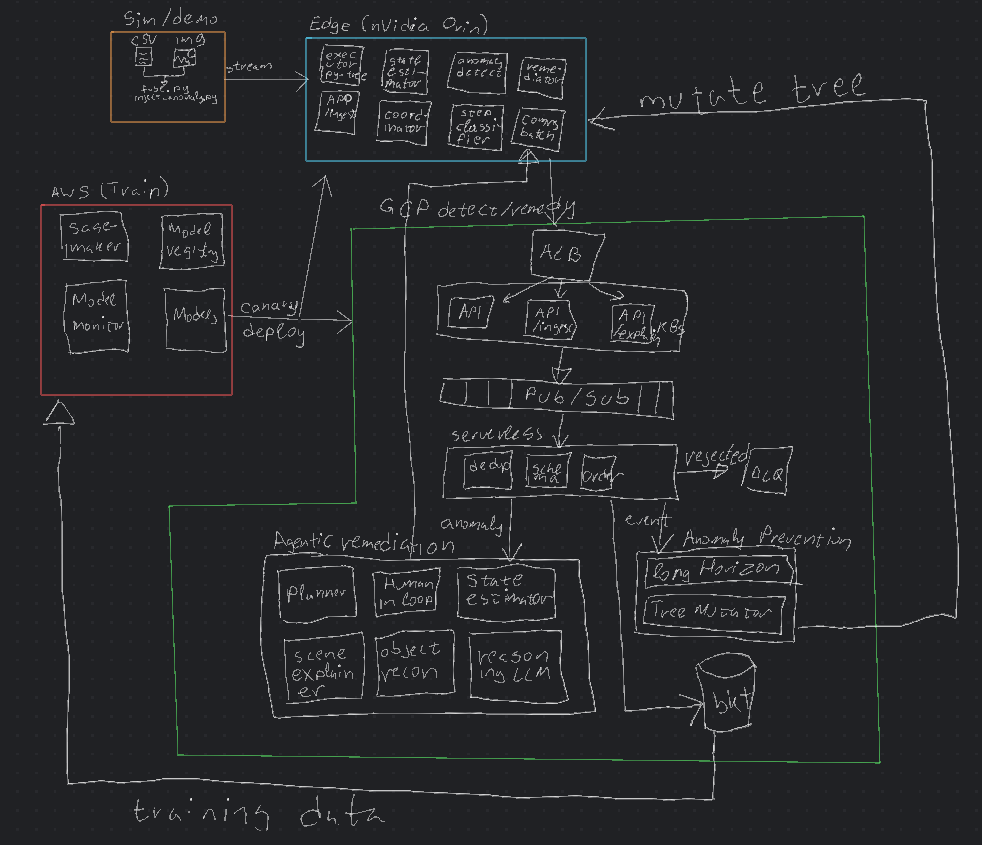

# KitchenWatch
Real-Time Multimodal Anomaly Detection & Fault-Tolerant AI Architecture for Collaborative Robotics


## Short Description
A distributed, real-time multimodal anomaly detection and recovery framework for collaborative robots operating among humans, combining local reflexive AI and cloud deliberative AI agents.


# 🧭 Overview
KitchenWatch is a real-time, multimodal anomaly detection and recovery system for collaborative robots operating in human environments.
It utilizes cutting-edge AI techniques across sensor fusion, anomaly detection, and multi-agent fault tolerance — with separate AWS (training) and GCP (detection) pipelines.

It achieves situational awareness by fusing multiple sensor data with camera feeds and task intent which makes it able to recover from varying urgency faults, either environmental or self-caused using hierarchical anomaly reasoning.
A local edge cognitive safety layer handles simple and semi complex anomalous situations while complex, resource intensive problems get handled at cloud level all while respecting on site urgent tasks as needed.


# 🧩 Key Features
* 🧠 Multimodal anomaly detection (sensor, camera, logs, intent fusion)
* ⚡ Two-tier detection architecture (Edge: real-time | Cloud: deliberative)
* 🤖 AI Agents (CrewAI) for safety, orchestration, recovery, human-in-loop
* 🪄 Explainable AI layer (FastAPI GET /explain)
* ☁️ AWS SageMaker for model training and GCP FastAPI for detection
* 🧱 Model Registry and drift monitoring
* 🧍 Human-assisted recovery via RAG + LLM
* 🧮 Testing and evaluation notebooks
* 📊 Prometheus/Grafana dashboards for observability
* 🧪 Dataset simulator to replay IoT/robot data and inject anomalies


🏗️ Architecture




Edge performs low-latency sensing + many lightweight detectors → a fusion/score layer computes a unified risk score → control arbiter enforces safety (stop/slow) and dispatches to agents (automated recovery or human), while cloud services do heavier correlation, logging and continuous learning.

# Flow summary:
    1. Edge collects telemetry + camera + sensor + intent data.
    2. Local detectors analyze streams and send scores to the fusion engine.
    3. The fusion engine computes a risk score and tier (1–3).
    4. Edge agents act immediately on Tier 1 (STOP) and Tier 2 (SLOW).
    5. Google cloud receives anomaly detected and plans remediation. Edge uses optimistic fallback
    6. Google Cloud receives fused events for deliberation, planning, and long horizon anomaly detection.
    7. Edge can receive alterations to behavior trees as a result of GCP deliberative layer.
    8. AWS training pipeline continuously improves detectors and meta-models.


# 🧠 AI Concepts

|Concept                      |Implementation|
|---                          |---|
|Online Anomaly Detection     |Isolation Forest, Autoencoder, Streaming Stats|
|Multimodal Fusion            |Sensor + Vision + Intent + Context|
|Edge-Cloud Partitioning      |Local reflex vs cloud deliberation|
|Explainability (XAI)         |SHAP + top contributing sensors|
|Agentic AI                   |CrewAI Orchestrator, Safety Agent, Recovery Agent|
|Human-in-the-Loop            |RAG + LLM guidance|
|Model Lifecycle              |AWS training, registry, drift checks|
|Observability                |Prometheus/Grafana metrics, OpenTelemetry traces|
|Testing & Validation         |CI notebooks, anomaly replay, confusion matrices|


# ⚙️ Getting Started
1️⃣ Setup
```
git clone https://gitlab.com/replikaa/kitchenwatch.git
cd kitchenwatch
pip install -r requirements.txt
```

2️⃣ Run Simulator
```
python edge/simulator/stream_simulator.py
```

3️⃣ Start Detection Pipelines
```
# Start local edge FastAPI service
uvicorn edge.api.main:app --host 0.0.0.0 --port 8080

# (In another terminal) Start cloud detection
uvicorn cloud.detection.fastapi_service:app --host 0.0.0.0 --port 9090
```

4️⃣ Observe Results
* Open http://localhost:3000 for Grafana dashboard
* Check logs/ for anomaly JSON events
* Use GET /explain?event_id=... to retrieve model explanations

🧪 Running Tests
```
pytest edge/tests
pytest cloud/tests
```

# 📈 Visualization & Evaluation

Use notebooks under /notebooks for:
* Fusion model evaluation (evaluate_fusion.ipynb)
* Drift detection (drift_analysis.ipynb)
* Explainability plots (explainability_plots.ipynb)


# 🧰 Tech Stack

|Languages:          |Python 3.12, Terraform|
|---|---|
|Frameworks:         |FastAPI, CrewAI, PyTorch, scikit-learn, HuggingFace Transformers|
|Infrastructure:     |AWS SageMaker, GCP Pub/Sub, Docker, Prometheus, Grafana, K8s|
|Data Fusion:        |NumPy, Pandas, River (for streaming ML), OpenCV, ONNXRuntime|
|Observability:      |OpenTelemetry|
|Explainability:     |SHAP, LIME|
|LLM & RAG:          |LangChain, ChromaDB|


# 🧩 Agents Overview

|Agent	                    |Purpose	                            |Location|
|---|---|---|
|SafetyAgent	            |Reflexive stop/slow actions	        |Edge|
|RecoveryAgent	            |Local retry/cleanup	                |Edge|
|StateEstimatorAgent	    |Tracks task, context, health	        |Edge|
|OrchestratorAgent	        |Coordinates CrewAI agents	            |Cloud|
|DeliberativeAgent	        |LLM + retrieval for complex recovery	|Cloud|
|HumanInterfaceAgent	    |RAG-powered operator dialogue	        |Cloud|


# 🛠️ Testing Scenarios

|Scenario	                    |Trigger	                |Expected Response|
|---|---|---|
|Dropped burger	                |Torque spike + occlusion	|Stop, identify drop, recover|
|Smoke detected	                |Smoke sensor rise	        |Stop, human notification|
|Ingredient moved by human	    |Vision mismatch	        |Pause, replan pick step|
|Spill detected	                |Surface audio + torque	    |Pause, cleanup routine|
|Lost vision	                |Occlusion + step timeout	|Slow, reattempt, escalate|


# 🧾 Evaluation Metrics

|Metric	                    |Description|
|---|---|
|Detection latency	        |Time from sensor input → decision|
|False positive rate	    |Safety vs unnecessary interruptions|
|MTTR	                    |Mean Time To Recover|
|Recovery success rate	    |% anomalies successfully resolved|
|Model drift score	        |Feature distribution change metric|


# 🧩 Future Work
* Time-aware task scheduler
* Reinforcement learning for recovery strategies
* Fleet-wide detection and coordination
* Integration with ROS2 / real robotic arm
* Federated anomaly training
* Securely encrypted communication with backend
* OTA updates of edge agents


# 🧹 Code Quality
KitchenWatch enforces production-level quality with:
* Ruff for linting + formatting
* mypy for static typing
* pytest for testing
* Bandit for security scanning
* pre-commit for local commit checks


# 🧑‍💻 Author
Andreas Nedelkos — Senior AI Engineer
Passionate about fault-tolerant, human-aware robotics and multimodal intelligence.

# 🏁 License
MIT License
