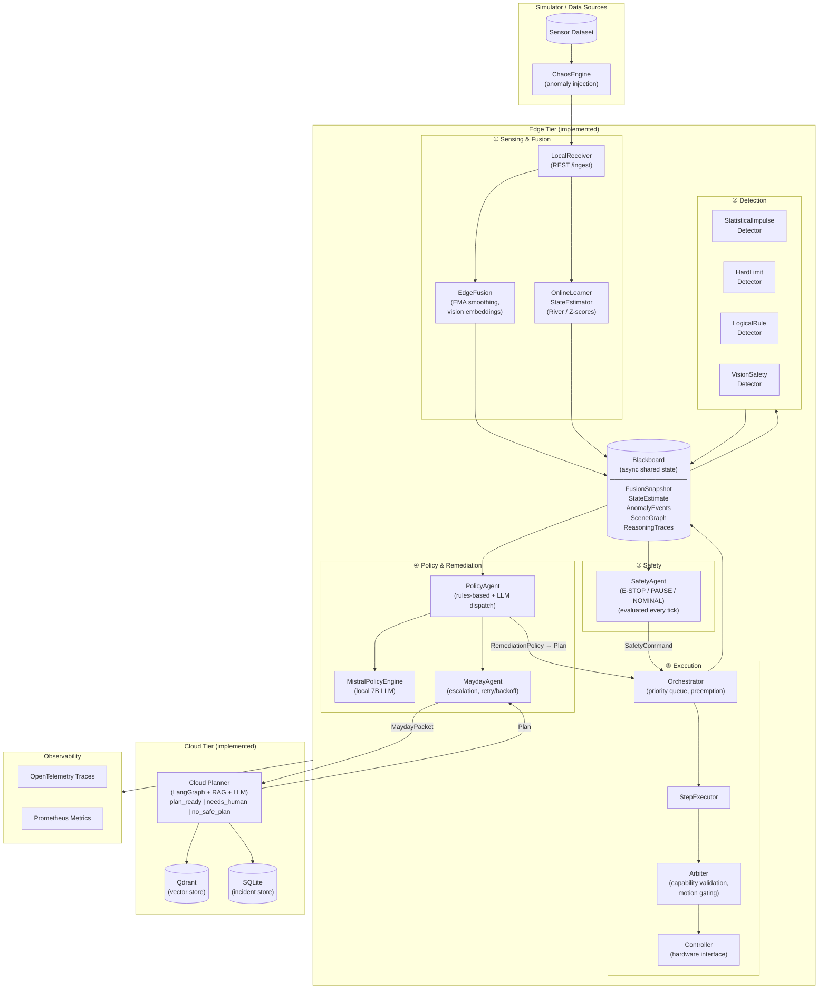

# CortexGuard
Real-Time Multimodal Anomaly Detection & Fault-Tolerant AI Architecture


## Short Description
A distributed, real-time multimodal anomaly detection and recovery framework for edge systems operating in human
environments, combining local reflexive AI and cloud deliberative AI agents.


# 🧭 Overview
CortexGuard is a real-time, multimodal anomaly detection and recovery system for edge-deployed systems operating in
human environments.
It utilizes cutting-edge AI techniques across sensor fusion, anomaly detection, and multi-agent fault tolerance.

It achieves situational awareness by fusing multiple sensor streams with camera feeds and task intent, enabling recovery
from varying-urgency faults using hierarchical anomaly reasoning.
A local edge cognitive safety layer handles reflexive and semi-complex anomalous situations while complex,
resource-intensive problems are escalated to the cloud deliberative planner — all while respecting in-progress tasks.


# 🧩 Key Features
* 🧠 Multimodal anomaly detection (sensor, vision, intent fusion)
* ⚡ Two-tier architecture (Edge: real-time reflexive | Cloud: deliberative, implemented)
* 🤖 AI Agents for safety, policy generation, and cloud escalation
* ☁️ Cloud deliberative planner (LangGraph + RAG + LLM, Docker service)
* 📊 Prometheus/Grafana dashboards for observability
* 🔭 OpenTelemetry distributed tracing
* 🧪 Dataset simulator with chaos engine for anomaly injection
* 🧹 Production-grade code quality (Ruff, mypy strict, Bandit, pre-commit)


🏗️ Architecture


```mermaid
flowchart TD

    subgraph SIM["Simulator / Data Sources"]
        DS[("Sensor Dataset")]
        CE["ChaosEngine\n(anomaly injection)"]
        DS --> CE
    end

    subgraph EDGE["Edge Tier (implemented)"]

        subgraph S1["① Sensing & Fusion"]
            RCV["LocalReceiver\n(REST /ingest)"]
            EF["EdgeFusion\n(EMA smoothing,\nvision embeddings)"]
            OLLE["OnlineLearner\nStateEstimator\n(River / Z-scores)"]
            RCV --> EF
            RCV --> OLLE
        end

        BB[("Blackboard\n(async shared state)\n─────────────────\nFusionSnapshot\nStateEstimate\nAnomalyEvents\nSceneGraph\nReasoningTraces")]

        subgraph S2["② Detection"]
            SID["StatisticalImpulse\nDetector"]
            HLD["HardLimit\nDetector"]
            LRD["LogicalRule\nDetector"]
            VSD["VisionSafety\nDetector"]
        end

        subgraph S3["③ Safety"]
            SA["SafetyAgent\n(E-STOP / PAUSE / NOMINAL)\n(evaluated every tick)"]
        end

        subgraph S4["④ Policy & Remediation"]
            PA["PolicyAgent\n(rules-based + LLM dispatch)"]
            MPE["MistralPolicyEngine\n(local 7B LLM)"]
            MA["MaydayAgent\n(escalation, retry/backoff)"]
            PA --> MPE
        end

        subgraph S5["⑤ Execution"]
            ORC["Orchestrator\n(priority queue, preemption)"]
            SE["StepExecutor"]
            ARB["Arbiter\n(capability validation,\nmotion gating)"]
            CTRL["Controller\n(hardware interface)"]
            ORC --> SE --> ARB --> CTRL
        end

        CE --> RCV
        EF --> BB
        OLLE --> BB

        BB --> S2
        S2 --> BB

        BB --> SA
        BB --> PA
        PA -->|RemediationPolicy → Plan| ORC
        PA --> MA
        SA -->|SafetyCommand| ORC
        ORC --> BB
    end

    subgraph CLOUD["Cloud Tier (implemented)"]
        CDA["Cloud Planner\n(LangGraph + RAG + LLM)\nplan_ready | needs_human | no_safe_plan"]
        QDR[("Qdrant\n(vector store)")]
        DB[("SQLite\n(incident store)")]
        CDA --> QDR
        CDA --> DB
    end

    MA -->|MaydayPacket| CDA
    CDA -->|Plan| MA

    subgraph OBS["Observability"]
        OTEL["OpenTelemetry Traces"]
        PROM["Prometheus Metrics"]
    end

    EDGE --> OBS
```

Edge performs low-latency sensing + lightweight detector ensemble → fusion layer maintains smoothed state → control
arbiter enforces safety (stop/slow) and dispatches to agents (automated recovery or escalation), while cloud handles
deliberative planning and model retraining.

# Flow summary:
    1. Edge collects telemetry + camera + sensor + intent data.
    2. Detector ensemble (statistical, rule-based, vision) analyses fused streams.
    3. SafetyAgent evaluates hard rules every tick → E-STOP / PAUSE / NOMINAL.
    4. PolicyAgent generates RemediationPolicy for active anomalies (rules + local LLM).
    5. Orchestrator schedules and preempts Plans; StepExecutor drives the Arbiter → Controller.
    6. MaydayAgent escalates to cloud planner when local recovery fails.
    7. Cloud planner retrieves similar incidents, generates a validated Plan via LLM, returns it to edge.


# 🧠 AI Concepts

|Concept                      |Implementation|
|---                          |---|
|Online Anomaly Detection     |Z-score / SPC (River), rule-based ensemble, vision proximity|
|Multimodal Fusion            |Sensor + Vision + Intent (EMA smoothing, torchvision embeddings)|
|Edge-Cloud Partitioning      |Local reflex vs cloud deliberation (optimistic fallback)|
|Agentic AI                   |SafetyAgent, PolicyAgent, MaydayAgent, Cloud Planner|
|LLM Policy Generation        |Mistral-7B-Instruct (on-device edge), pluggable cloud LLM (Groq/Anthropic/mock)|
|Cloud Deliberative Planning  |LangGraph 5-node workflow, RAG over incident history (Qdrant + MiniLM), capability validation|
|Model Lifecycle              |AWS SageMaker (future deployment target)|
|Observability                |Prometheus/Grafana metrics, OpenTelemetry traces|
|Testing & Validation         |Unit, integration (chaos engine), e2e — 80% coverage enforced|


# ⚡ Quick Demo


See anomaly detection and cloud deliberative planning in action with a single command — no Python install required:

```bash
# Default: repeated misgrasp → edge retries → escalates to cloud planner → Grafana shows plan
docker compose -f docker-compose.demo.yaml up --build

# With Groq API key for real LLM plans (free tier available at console.groq.com)
CLOUD_GROQ_API_KEY=<your-key> docker compose -f docker-compose.demo.yaml up --build

# Try other scenarios
SCENARIO=S0.1 docker compose -f docker-compose.demo.yaml up --build   # human in safety radius → E-STOP
SCENARIO=S0.2 docker compose -f docker-compose.demo.yaml up --build   # overheat + smoke → E-STOP
SCENARIO=S2.3 docker compose -f docker-compose.demo.yaml up --build   # sensor freeze → local recovery
SCENARIO=S4.1 docker compose -f docker-compose.demo.yaml up --build   # compound fault → recovery or escalate
```

The simulator streams synthetic sensor data with injected anomalies to the edge service in an infinite loop. Watch the simulator logs for live detection output, or open Grafana at `http://localhost:3000` (no login required).

**Grafana shows:**
- Edge: anomaly detection, safety state, plan execution latency, LLM circuit breaker
- Cloud Planner row: escalation count, plan decisions (plan_ready / needs_human), p95 planning latency
- Recent Cloud Plans panel: live log of LLM-generated recovery plan rationales (Loki)
- Tempo: full distributed traces linking edge MaydayAgent spans to cloud planning nodes

> **No API key?** The cloud planner automatically falls back to mock mode — canned recovery plans are generated and the full workflow (RAG retrieval, validation, Prometheus metrics, Loki logs, OTEL traces) still runs. Set `CLOUD_GROQ_API_KEY` for real LLM-generated plans via Groq (free tier, no credit card required).

> **Edge LLM (Mistral-7B):** The Docker demo runs edge policy in mock mode — no model weights downloaded. Set `POLICY_USE_MOCK=false` outside Docker with `task venv` + `task edge:run` to enable real on-device inference. Requires ~4GB download on first run; CUDA GPU recommended (RTX 3060 or better, ~10–15s per inference).

To list all available scenarios:
```bash
PYTHONPATH=src uv run python demo/chaos_stream.py --list
```


# ⚙️ Getting Started

1️⃣ Setup
```bash
task venv          # full install (includes torch/transformers)
task venv-slim     # slim install — no torch/transformers, sufficient for demo
```

2️⃣ Run the Edge API (host)
```bash
task edge:run
```

Interactive API reference available at `http://localhost:8080/docs` (Swagger UI) or `http://localhost:8080/redoc` (ReDoc) once the service is running.

3️⃣ Stream simulated data
```bash
# Fuse raw data into JSONL
task simulate:fuse

# Stream to the edge
task simulate:stream

# Stream a named anomaly scenario to a running edge
PYTHONPATH=src uv run python demo/chaos_stream.py --scenario S0.1

# Or run the full demo stack in Docker
task demo:up
```

4️⃣ Run tests
```bash
task test          # unit + integration, with coverage
task test-unit     # unit only
task test-e2e      # end-to-end
```


# 🧩 Agents

| Agent | Purpose | Location |
|---|---|---|
| `SafetyAgent` | Evaluates hard safety rules every tick → E-STOP / PAUSE / NOMINAL | Edge (implemented) |
| `PolicyAgent` | Generates RemediationPolicy via rules-based dispatch or local LLM | Edge (implemented) |
| `MaydayAgent` | Escalates to cloud when local recovery fails; handles retry/backoff | Edge (implemented) |
| Cloud Planner | 5-node LangGraph workflow: retrieval → LLM planning → validation → routing | Cloud (implemented) |
| Explanation Agent | Translates anomaly events into human-readable summaries | Cloud (future) |


# 🛠️ Testing Scenarios

|Scenario                     |Trigger                    |Expected Response|
|---|---|---|
|Item dropped                 |Torque spike + occlusion   |Stop, identify drop, recover|
|Smoke detected               |Smoke sensor rise          |Stop, human notification|
|Item displaced by human      |Vision mismatch            |Pause, replan pick step|
|Human in safety radius       |Vision proximity < 0.5m    |E-STOP immediate|
|Sensor freeze                |Static readings detected   |Hold state, retry, warn|


# 🧾 Evaluation Metrics

|Metric                    |Description|
|---|---|
|Detection latency         |Time from sensor input → decision|
|False positive rate       |Safety interruptions without real anomaly|
|MTTR                      |Mean Time To Recover|
|Recovery success rate     |% anomalies successfully resolved locally|
|Escalation rate           |% anomalies requiring cloud involvement|


# 🧰 Tech Stack

|Languages:          |Python 3.12|
|---|---|
|Frameworks:         |FastAPI, LangGraph, PyTorch, HuggingFace Transformers, River|
|LLM (edge):         |Mistral-7B-Instruct-v0.2 (on-device inference)|
|LLM (cloud):        |Pluggable — Groq (Llama 3.3 70B), Anthropic (Claude Haiku), mock|
|Vector store:       |Qdrant + sentence-transformers MiniLM (384-dim)|
|Infrastructure:     |Docker, Prometheus, Grafana, OpenTelemetry/Tempo|
|Observability:      |OpenTelemetry|
|Data Fusion:        |NumPy, Pandas, torchvision|
|Testing:            |pytest, pytest-asyncio, pytest-cov|


# 🧩 Future Work
* Explanation Agent — translate anomaly events to human-readable operator summaries (cloud)
* Human-in-the-Loop operator approval flow for high-uncertainty cloud plans
* Fleet-wide detection and coordination
* Reinforcement learning for recovery strategies
* Federated anomaly training
* Integration with real edge hardware controllers
* OTA updates of edge agents


# 🧹 Code Quality
CortexGuard enforces production-level quality with:
* Ruff for linting + formatting
* mypy strict mode for static typing
* pytest with 80% coverage minimum
* Bandit for security scanning
* pre-commit for local commit checks


# 🧑‍💻 Author
Andreas Nedelkos

# 🏁 License
MIT License
