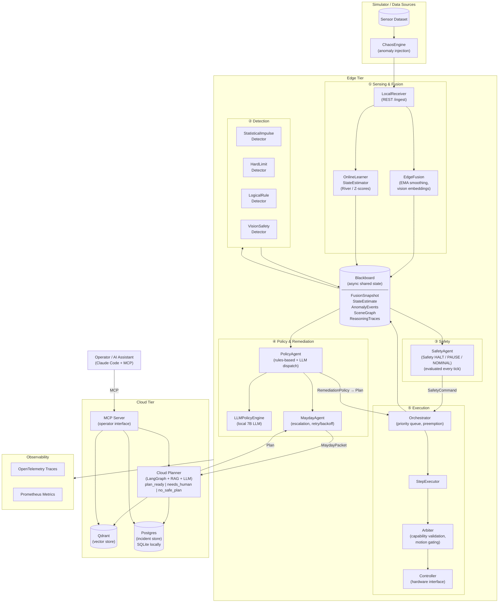
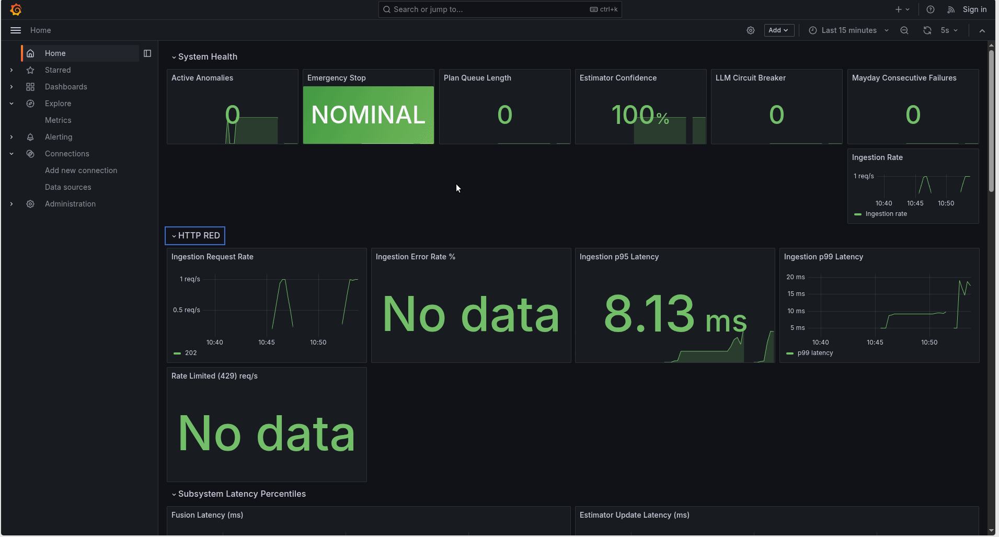
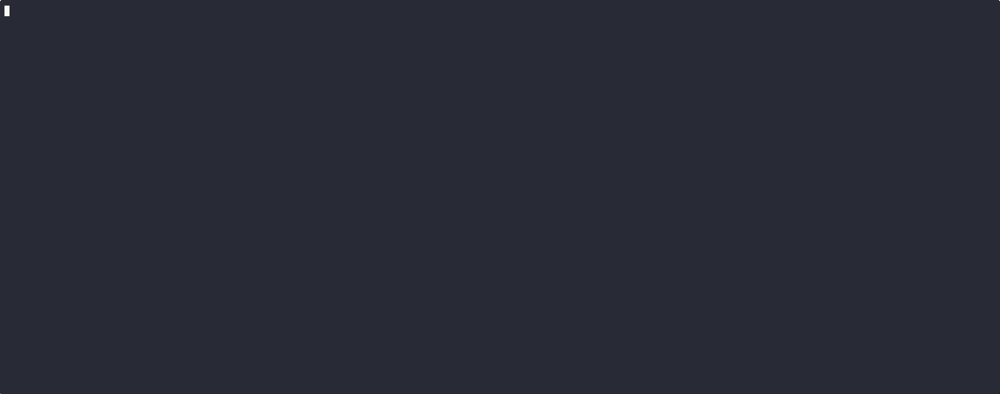
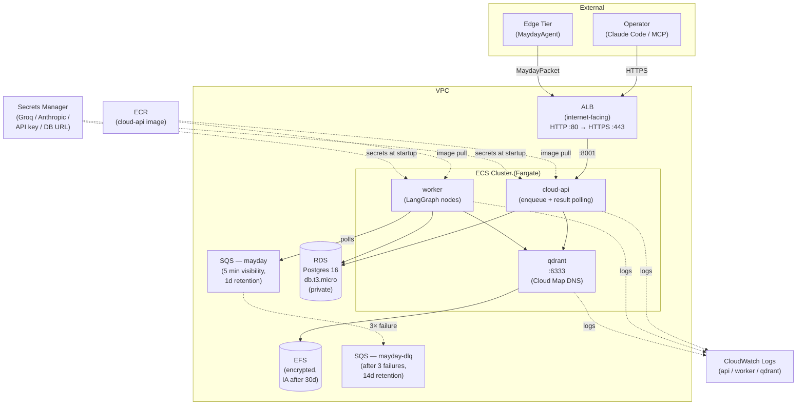

# CortexGuard
Runtime safety and recovery layer for autonomous systems


## Short Description
Autonomous systems fail mid-task: dropped items, thermal spikes, sensor faults, vision anomalies. Recovery has to
happen in milliseconds, but deliberative AI is too slow for hard real-time and too rigid to handle novel failures.
CortexGuard is the control layer between them: a two-tier safety and recovery system for autonomous systems executing
tasks in proximity to humans and equipment.


# 🧭 Overview
CortexGuard monitors autonomous systems in real time, detects faults across sensor, vision, and task-intent streams,
and drives recovery, locally when possible, via cloud deliberative AI when the fault is more complex. Built for systems
that execute physical tasks near humans: robot arms, autonomous vehicles, and similar edge-deployed actuators.

The edge tier makes reflexive decisions in milliseconds (Safety HALT, PAUSE, local remediation plan). When a fault exceeds
local reasoning capacity, it escalates to the cloud planner, which retrieves similar past incidents, generates a
validated recovery plan via LLM, and returns it to the edge, all while the edge continues operating safely.


# 🧩 Key Features
* 🧠 Detects faults across sensor, vision, and task-intent streams: statistical, rule-based, and vision detectors run in parallel every tick
* ⚡ Sub-millisecond edge decisions (Safety HALT / PAUSE / NOMINAL) with LLM-generated remediation for non-trivial faults
* ☁️ Cloud deliberative planner handles novel failures: RAG over incident history → LLM plan → capability validation → edge execution
* 🔌 Human-in-the-loop via MCP: operators inspect incidents, approve or override plans, and feed resolutions back into the RAG store
* 📊 Full observability: Prometheus/Grafana dashboards, OpenTelemetry distributed traces (edge → cloud), structured JSON logs
* 🧪 Chaos engine for anomaly injection: replay real datasets or inject fault scenarios against a live edge


🏗️ Architecture


```mermaid
flowchart TD

    subgraph SIM["Simulator / Data Sources"]
        DS[("Sensor Dataset")]
        CE["ChaosEngine\n(anomaly injection)"]
        DS --> CE
    end

    subgraph EDGE["Edge Tier "]

        subgraph S1["① Sensing & Fusion"]
            RCV["LocalReceiver\n(REST /ingest)"]
            EF["EdgeFusion\n(EMA smoothing,\nvision embeddings)"]
            OLLE["OnlineLearner\nStateEstimator\n(River / Z-scores)"]
            RCV --> EF
            RCV --> OLLE
        end

        BB[("Blackboard\n(async shared state)\n─────────────────\nFusionSnapshot\nStateEstimate\nAnomalyEvents\nSceneGraph\nReasoningTraces")]

        subgraph S2["② Detection"]
            SID["StatisticalImpulse\nDetector"]
            HLD["HardLimit\nDetector"]
            LRD["LogicalRule\nDetector"]
            VSD["VisionSafety\nDetector"]
        end

        subgraph S3["③ Safety"]
            SA["SafetyAgent\n(Safety HALT / PAUSE / NOMINAL)\n(evaluated every tick)"]
        end

        subgraph S4["④ Policy & Remediation"]
            PA["PolicyAgent\n(rules-based + LLM dispatch)"]
            MPE["LLMPolicyEngine\n(local 7B LLM)"]
            MA["MaydayAgent\n(escalation, retry/backoff)"]
            PA --> MPE
        end

        subgraph S5["⑤ Execution"]
            ORC["Orchestrator\n(priority queue, preemption)"]
            SE["StepExecutor"]
            ARB["Arbiter\n(capability validation,\nmotion gating)"]
            CTRL["Controller\n(hardware interface)"]
            ORC --> SE --> ARB --> CTRL
        end

        CE --> RCV
        EF --> BB
        OLLE --> BB

        BB --> S2
        S2 --> BB

        BB --> SA
        BB --> PA
        PA -->|RemediationPolicy → Plan| ORC
        PA --> MA
        SA -->|SafetyCommand| ORC
        ORC --> BB
    end

    subgraph CLOUD["Cloud Tier "]
        CDA["Cloud Planner\n(LangGraph + RAG + LLM)\nplan_ready | needs_human | no_safe_plan"]
        QDR[("Qdrant\n(vector store)")]
        DB[("Postgres\n(incident store)\nSQLite locally")]
        MCPS["MCP Server\n(operator interface)"]
        CDA --> QDR
        CDA --> DB
        MCPS --> DB
        MCPS --> QDR
        MCPS --> CDA
    end

    OP["Operator / AI Assistant\n(Claude Code + MCP)"]
    OP -->|MCP| MCPS

    MA -->|MaydayPacket| CDA
    CDA -->|Plan| MA

    subgraph OBS["Observability"]
        OTEL["OpenTelemetry Traces"]
        PROM["Prometheus Metrics"]
    end

    EDGE --> OBS
```

Edge performs low-latency sensing + lightweight detector ensemble → fusion layer maintains smoothed state → control
arbiter enforces safety (stop/slow) and dispatches to agents (automated recovery or escalation), while cloud handles
deliberative planning via LLM and surfaces operator tooling via MCP.

# Flow summary:
    1. Sensor readings, camera frames, and task intent are fused into a smoothed state snapshot every tick.
    2. Four detectors run in parallel: statistical impulse, hard-limit thresholds, logical rules, vision proximity.
    3. SafetyAgent evaluates hard safety rules → Safety HALT / PAUSE / NOMINAL command issued immediately.
    4. PolicyAgent generates a RemediationPolicy (rules-based or local LLM) and schedules a recovery Plan.
    5. Orchestrator executes the Plan via StepExecutor → Arbiter (capability gating) → Controller.
    6. If local recovery fails after retries, MaydayAgent escalates to the cloud planner.
    7. Cloud planner retrieves similar past incidents via RAG, generates a validated Plan via LLM, returns it to the edge.


# 🧠 How the detection and planning stack works

|Concept                      |Implementation|
|---                          |---|
|Online Anomaly Detection     |Z-score / SPC (River), rule-based ensemble, vision proximity|
|Multimodal Fusion            |Sensor + Vision + Intent (EMA smoothing, torchvision embeddings)|
|Edge-Cloud Partitioning      |Local reflex vs cloud deliberation (optimistic fallback)|
|Agentic AI                   |SafetyAgent, PolicyAgent, MaydayAgent, Cloud Planner|
|LLM Policy Generation        |Qwen/Qwen2.5-7B-Instruct (on-device edge), pluggable cloud LLM (Groq/Anthropic/mock)|
|Cloud Deliberative Planning  |LangGraph 5-node workflow, RAG over incident history (Qdrant + MiniLM), capability validation|
|Cloud Infrastructure         |AWS ECS (Fargate), ECS, ALB, RDS (Postgres), EFS, SQS, Secrets Manager, ECR|
|Observability                |Prometheus/Grafana metrics, OpenTelemetry traces|
|Testing & Validation         |Unit, integration (chaos engine), e2e. 80% coverage enforced|


# ⚡ Quick Demo



See anomaly detection and cloud deliberative planning in action, no Python install required. Copy your Groq API key to `.env` first (free tier at console.groq.com):

```
CLOUD_GROQ_API_KEY=gsk_...
```

**Terminal 1** - start the full stack (normal baseline, S0.0):
```bash
task demo:up          # or: task demo:up-rebuild on first run
```

**Terminal 2** - seed the RAG store with resolved historical incidents (once per fresh volume):
```bash
task demo:seed-rag
```

**Terminal 2** - inject an anomaly scenario to trigger cloud escalation:
```bash
task demo:inject SCENARIO=S1.1   # repeated misgrasp → escalates to cloud planner
```

Grafana is at `http://localhost:3000` (no login). Other scenarios:
```bash
task demo:inject SCENARIO=S0.1   # human in safety radius → Safety HALT
task demo:inject SCENARIO=S0.2   # overheat + smoke → Safety HALT
task demo:inject SCENARIO=S2.3   # sensor freeze → local recovery
task demo:inject SCENARIO=S4.1   # compound fault → recovery or escalate
```

**Grafana shows:**
- Edge: anomaly detection, safety state, plan execution latency, LLM circuit breaker
- Cloud Planner row: escalation count, plan decisions (plan_ready / needs_human), p95 planning latency
- RAG Retrieval Similarity: top-1 similarity score per planning run (labelled by anomaly type)
- Recent Cloud Plans panel: live log of LLM-generated recovery plan rationales (Loki)
- Tempo: full distributed traces linking edge MaydayAgent spans to cloud planning nodes

> **No API key?** The cloud planner falls back to mock mode automatically, canned recovery plans are generated and the full observability stack (Prometheus, Loki, Tempo) still runs.

> **Edge LLM (Qwen2.5-7B):** The Docker demo runs edge policy in mock mode, no model weights downloaded. Set `POLICY_USE_MOCK=false` outside Docker with `task venv` + `task edge:run` to enable real on-device inference. Requires ~4GB download on first run; CUDA GPU recommended (RTX 3060 or better, ~10–15s per inference).

To list all available scenarios:
```bash
task demo:inject --list   # or: uv run python demo/chaos_stream.py --list
```


# 🧑‍💻 MCP Operator Demo (Human-in-the-Loop)

When local recovery fails, most systems either halt silently or require manual inspection with no context. CortexGuard escalates to a human operator with RAG-retrieved incident history, then stores the resolution back into memory so the next occurrence costs less.



A compound fault triggers a safety Halt → MaydayAgent escalates to the cloud LLM → low confidence on the response surfaces a human operator via MCP → past incident context is retrieved from Qdrant → the operator resolves it → resolution is written back to RAG.

When the cloud planner returns `needs_human`, an operator connects via Claude Code and resolves the incident interactively: inspecting the plan, requesting alternatives, and feeding the outcome back into the RAG store.

The demo stack (`task demo:up`) forces `needs_human` on every cloud escalation (`CLOUD_MIN_CONFIDENCE=1.1`), so every injected anomaly reaches the operator queue.

**1. Start the stack and seed RAG** (see demo section above), then inject an anomaly:

```bash
task demo:inject SCENARIO=S1.1
```

**2. Register the MCP server with Claude Code** (one-time):

```bash
claude mcp add cortexguard -- docker exec -i cortexguard-cloud-api python -m cortexguard.cloud.mcp_server
```

**3. Open a new Claude Code session and interact naturally:**

```
> A CortexGuard needs_human alert just fired. Use get_latest_incident to see what happened.
> Explain the proposed plan in plain English. I'm a hardware operator, not an engineer.
> The plan looks good. Record that I resolved this by re-seating the gripper. Outcome: resolved.
```

```
> I can't do the force-retry step. It's not safe given current device state. Generate an alternative plan that avoids it.
> Record that I intervened manually and brought the device back to nominal. Outcome: resolved.
```

Claude calls the MCP tools automatically. Each resolution is re-embedded in Qdrant, the next similar escalation retrieves it as a prior example, and Groq generates a more informed plan.

> **With a real LLM:** Set `CLOUD_GROQ_API_KEY=<your-key>` in `.env` for Groq (free tier). The explain step uses the same backend unless `CLOUD_EXPLAIN_BACKEND` is set separately (e.g. a local Ollama model).


# ⚙️ Getting Started

1️⃣ Setup
```bash
task venv          # full install (includes torch/transformers)
task venv-slim     # slim install no torch/transformers, sufficient for demo
```

2️⃣ Run the Edge API (host)
```bash
task edge:run
```

Interactive API reference available at `http://localhost:8080/docs` (Swagger UI) or `http://localhost:8080/redoc` (ReDoc) once the service is running.

3️⃣ Stream simulated data
```bash
# Fuse raw data into JSONL
task simulate:fuse

# Stream to the edge
task simulate:stream

# Stream a named anomaly scenario to a running edge
PYTHONPATH=src uv run python demo/chaos_stream.py --scenario S0.1

# Or run the full demo stack in Docker
task demo:up
```

4️⃣ Run tests
```bash
task test          # unit + integration, with coverage
task test-unit     # unit only
task test-e2e      # end-to-end
```


# 🧩 Agents

| Agent | Purpose | Location |
|---|---|---|
| `SafetyAgent` | Evaluates hard safety rules every tick → Safety HALT / PAUSE / NOMINAL | Edge |
| `PolicyAgent` | Generates RemediationPolicy via rules-based dispatch or local LLM | Edge |
| `MaydayAgent` | Escalates to cloud when local recovery fails; handles retry/backoff | Edge |
| Cloud Planner | 5-node LangGraph workflow: retrieval → LLM planning → validation → routing | Cloud |
| MCP Server | Operator inspection interface: incident history, on-demand planning, plan explanation, and resolution capture via Claude Code | Cloud |


# 🛠️ Testing Scenarios

|Scenario                     |Trigger                    |Expected Response|
|---|---|---|
|Item dropped                 |Torque spike + occlusion   |Stop, identify drop, recover|
|Smoke detected               |Smoke sensor rise          |Stop, human notification|
|Item displaced by human      |Vision mismatch            |Pause, replan pick step|
|Human in safety radius       |Vision proximity < 0.5m    |Safety Halt immediate|
|Sensor freeze                |Static readings detected   |Hold state, retry, warn|


# 🧾 Evaluation Metrics

|Metric                    |Description|
|---|---|
|Detection latency         |Time from sensor input → decision|
|False positive rate       |Safety interruptions without real anomaly|
|MTTR                      |Mean Time To Recover|
|Recovery success rate     |% anomalies successfully resolved locally|
|Escalation rate           |% anomalies requiring cloud involvement|


# 🧰 Tech Stack

|Languages:          |Python 3.12|
|---|---|
|Frameworks:         |FastAPI, LangGraph, PyTorch, HuggingFace Transformers, River|
|LLM (edge):         |Qwen/Qwen2.5-7B-Instruct (on-device inference)|
|LLM (cloud):        |Pluggable Groq (Llama 3.3 70B), Anthropic (Claude Haiku), mock|
|Vector store:       |Qdrant + sentence-transformers MiniLM (384-dim)|
|Infrastructure:     |Docker (local/demo), AWS ECS Fargate + Terraform (production)|
|Observability:      |OpenTelemetry|
|Data Fusion:        |NumPy, Pandas, torchvision|
|Testing:            |pytest, pytest-asyncio, pytest-cov|


# ☁️ Production Deployment (AWS)

The cloud tier deploys to AWS ECS Fargate via Terraform (see `terraform/`). Resources provisioned: ECS cluster, ALB, RDS (Postgres 16), EFS (Qdrant storage), SQS queues, Secrets Manager, ECR, CloudWatch, and service discovery.

```bash
cd terraform
cp terraform.tfvars.example terraform.tfvars   # fill in secrets
terraform init && terraform apply
```

Full deployment and teardown instructions: [`docs/OPERATIONS.md`](docs/OPERATIONS.md).


# 🗺️ AWS Infrastructure


```mermaid
flowchart TD
    subgraph EXT["External"]
        EDGE["Edge Tier\n(MaydayAgent)"]
        OP["Operator\n(Claude Code / MCP)"]
    end

    subgraph VPC["VPC"]
        ALB["ALB\n(internet-facing)\nHTTP :80 → HTTPS :443"]

        subgraph CLUSTER["ECS Cluster (Fargate)"]
            API["cloud-api\n(enqueue + result polling)"]
            WORKER["worker\n(LangGraph nodes)"]
            QDRANT["qdrant\n:6333\n(Cloud Map DNS)"]
        end

        RDS[("RDS\nPostgres 16\ndb.t3.micro\n(private)")]
        EFS[("EFS\n(encrypted,\nIA after 30d)")]
        SQS["SQS — mayday\n(5 min visibility,\n1d retention)"]
        DLQ["SQS — mayday-dlq\n(after 3 failures,\n14d retention)"]
    end

    ECR["ECR\n(cloud-api image)"]
    SM["Secrets Manager\n(Groq / Anthropic /\nAPI key / DB URL)"]
    CW["CloudWatch Logs\n(api / worker / qdrant)"]

    OP -->|HTTPS| ALB
    EDGE -->|MaydayPacket| ALB
    ALB -->|:8001| API
    WORKER -->|polls| SQS
    SQS -.->|3× failure| DLQ
    API --> RDS
    API --> QDRANT
    WORKER --> RDS
    WORKER --> QDRANT
    QDRANT --> EFS

    ECR -.->|image pull| API
    ECR -.->|image pull| WORKER
    SM -.->|secrets at startup| API
    SM -.->|secrets at startup| WORKER
    API -.->|logs| CW
    WORKER -.->|logs| CW
    QDRANT -.->|logs| CW
```

All resources are Terraform-managed. Solid lines = data flow; dashed lines = infrastructure provisioning / configuration at deploy/startup time.
IA = Infrequent Access, a cheaper EFS storage class

# 🧹 Code Quality
CortexGuard enforces production-level quality with:
* Ruff for linting + formatting
* mypy strict mode for static typing
* pytest with 80% coverage minimum
* Bandit for security scanning


# 🧑‍💻 Author
Andreas Nedelkos

# 🏁 License
MIT License
