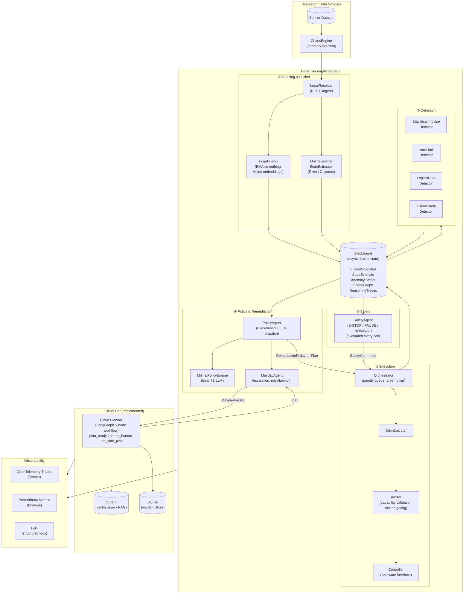

# Architecture Diagram

```mermaid
flowchart TD

    subgraph SIM["Simulator / Data Sources"]
        DS[("Sensor Dataset")]
        CE["ChaosEngine\n(anomaly injection)"]
        DS --> CE
    end

    subgraph EDGE["Edge Tier (implemented)"]

        subgraph S1["① Sensing & Fusion"]
            RCV["LocalReceiver\n(REST /ingest)"]
            EF["EdgeFusion\n(EMA smoothing,\nvision embeddings)"]
            OLLE["OnlineLearner\nStateEstimator\n(River / Z-scores)"]
            RCV --> EF
            RCV --> OLLE
        end

        BB[("Blackboard\n(async shared state)\n─────────────────\nFusionSnapshot\nStateEstimate\nAnomalyEvents\nSceneGraph\nReasoningTraces")]

        subgraph S2["② Detection"]
            SID["StatisticalImpulse\nDetector"]
            HLD["HardLimit\nDetector"]
            LRD["LogicalRule\nDetector"]
            VSD["VisionSafety\nDetector"]
        end

        subgraph S3["③ Safety"]
            SA["SafetyAgent\n(E-STOP / PAUSE / NOMINAL)\n(evaluated every tick)"]
        end

        subgraph S4["④ Policy & Remediation"]
            PA["PolicyAgent\n(rules-based + LLM dispatch)"]
            MPE["MistralPolicyEngine\n(local 7B LLM)"]
            MA["MaydayAgent\n(escalation, retry/backoff)"]
            PA --> MPE
        end

        subgraph S5["⑤ Execution"]
            ORC["Orchestrator\n(priority queue, preemption)"]
            SE["StepExecutor"]
            ARB["Arbiter\n(capability validation,\nmotion gating)"]
            CTRL["Controller\n(hardware interface)"]
            ORC --> SE --> ARB --> CTRL
        end

        CE --> RCV
        EF --> BB
        OLLE --> BB

        BB --> S2
        S2 --> BB

        BB --> SA
        BB --> PA
        PA -->|RemediationPolicy → Plan| ORC
        PA --> MA
        SA -->|SafetyCommand| ORC
        ORC --> BB
    end

    subgraph CLOUD["Cloud Tier (implemented)"]
        CDA["Cloud Planner\n(LangGraph 5-node workflow)\nplan_ready | needs_human | no_safe_plan"]
        QDR[("Qdrant\n(vector store / RAG)")]
        DB[("SQLite\n(incident store)")]
        CDA --> QDR
        CDA --> DB
    end

    MA -->|MaydayPacket| CDA
    CDA -->|Plan| MA

    subgraph OBS["Observability"]
        OTEL["OpenTelemetry Traces\n(Tempo)"]
        PROM["Prometheus Metrics\n(Grafana)"]
        LOKI["Loki\n(structured logs)"]
    end

    EDGE --> OBS
    CLOUD --> OBS
```
